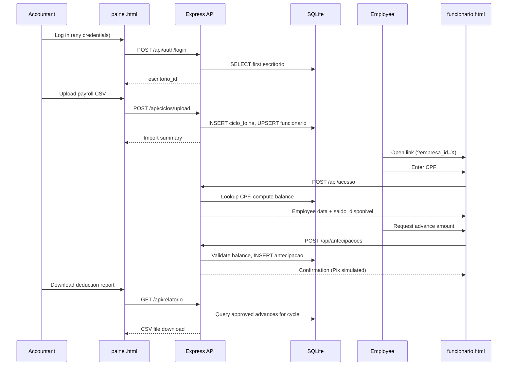

# Technical Documentation — Ágio

**Author:** Lucas Galvão  
**Institution:** Inteli — Instituto de Tecnologia e Liderança  
**Program:** Information Systems, Entrepreneurship Track  
**Document version:** 2.0 — aligned with the implemented codebase (June 2026)

---

## 1. Introduction

Ágio is a B2B2C earned wage access (EWA) fintech prototype developed as the technical component of an undergraduate capstone project. The product enables formally employed CLT workers to request salary advances against their accrued earnings, with automatic deduction from the next payroll cycle. Distribution occurs through accounting firms that already manage payroll for small and medium enterprises (SMEs) with 10 to 100 employees.

The technical solution is a **full-stack web monolith**: a single Node.js process serves a REST API, static frontend pages, and an embedded SQLite database. The implementation covers the complete operational cycle — payroll ingestion, limit calculation, advance request, and deduction reporting — using **fictional data only**. No real financial transactions, payment rails, or personal data are processed.

> **Scope note:** The implementation was deliberately kept lean, in agreement with the academic advisor, to prioritize end-to-end demonstrability within the available project timeline. The sections below describe what was built and how it works; production-grade concerns (authentication, payment integration, LGPD compliance) are acknowledged where relevant but not implemented.

---

## 2. System Context and Actors

The application serves three distinct user roles through separate interfaces:

| Actor | Interface | Primary actions |
|---|---|---|
| **Accounting office (contador)** | `index.html` → `painel.html` | Log in, manage client companies, upload payroll CSV, monitor employees and advances, download deduction reports |
| **Employer (empresa)** | Indirect — via CSV upload | Provides payroll data; does not interact with the system directly |
| **Employee (funcionário CLT)** | `funcionario.html` | Access via company-specific link, authenticate with CPF, view available balance, request advances, review history |

The employer is modeled implicitly: company records belong to an accounting office, and employee data enters the system exclusively through payroll CSV uploads performed by the accountant.

---

## 3. Architecture Overview

### 3.1 Architectural pattern

Ágio follows a **monolithic three-tier architecture** within a single deployable unit:

```
┌─────────────────────────────────────────────────────────────┐
│                    Presentation Layer                        │
│   index.html  │  painel.html  │  funcionario.html  │  CSS   │
│              (Vanilla HTML/CSS/JavaScript)                   │
└──────────────────────────┬──────────────────────────────────┘
                           │ HTTP (JSON / static files)
┌──────────────────────────▼──────────────────────────────────┐
│                    Application Layer                         │
│              Express.js REST API (/api/*)                      │
│   auth │ empresas │ funcionarios │ ciclos │ antecipacoes    │
│              relatorio │ acesso                              │
└──────────────────────────┬──────────────────────────────────┘
                           │ better-sqlite3 (synchronous SQL)
┌──────────────────────────▼──────────────────────────────────┐
│                      Data Layer                              │
│                   SQLite (agio.db)                             │
└─────────────────────────────────────────────────────────────┘
```

There is no service layer, repository abstraction, or ORM. Business logic resides directly in route handlers, with shared calculations (e.g., advance ceiling) duplicated across three modules. This design minimizes indirection and accelerates development for a demonstration MVP.

### 3.2 Request lifecycle

1. The browser loads static HTML/CSS/JS from `public/` via `express.static`.
2. Client-side JavaScript calls REST endpoints under `/api/*`, passing identifiers (`escritorio_id`, `empresa_id`, `funcionario_id`) as query parameters or request body fields.
3. Route handlers execute parameterized SQL queries against SQLite and return JSON responses (or CSV for reports).
4. The frontend updates the DOM based on API responses; there is no client-side routing framework.

### 3.3 Bootstrapping

On startup, `server.js` loads the database module, checks whether the `escritorio` table is empty, and automatically runs `seed.js` if no data exists. This ensures that freshly deployed instances (including cloud environments with ephemeral filesystems) contain demo data without manual intervention.

```javascript
const count = db.prepare('SELECT COUNT(*) as n FROM escritorio').get();
if (count.n === 0) {
  require('./seed');
}
```

---

## 4. Technology Stack

| Layer | Technology | Version | Rationale |
|---|---|---|---|
| Runtime | Node.js | 20.x | LTS stability; required for `better-sqlite3` native bindings |
| Web framework | Express | 4.18.x | Minimal HTTP server with middleware ecosystem |
| Database | SQLite via `better-sqlite3` | 9.4.x | Zero-configuration, single-file storage, synchronous API suitable for low-volume demo workloads |
| File upload | Multer | 1.4.x | Multipart form handling for CSV uploads |
| CSV parsing | `csv-parse/sync` | 5.5.x | Synchronous parsing with column mapping |
| CORS | `cors` | 2.8.x | Permissive cross-origin access (development/demo) |
| Frontend | HTML5, CSS3, Vanilla JavaScript | — | No build step, no framework overhead |
| Typography | Google Fonts (CDN) | — | Bricolage Grotesque (headings), DM Sans (body) |
| Hosting (documented) | Render free tier | — | Public demo deployment |

**Explicitly absent:** frontend frameworks (React, Vue), ORM (Sequelize, Prisma), automated tests, containerization (Docker), CI/CD pipelines, message queues, and external payment/BaaS integrations.

---

## 5. Project Structure

```
agio/
├── server.js              # Application entry point
├── db.js                  # Database connection, schema DDL, pragmas
├── seed.js                # Fictional demo data
├── package.json           # Dependencies and npm scripts
├── agio.db                # SQLite database (runtime, gitignored)
├── uploads/               # Temporary CSV storage (gitignored)
│
├── routes/
│   ├── auth.js            # Accounting office login
│   ├── empresas.js        # Company listing and registration
│   ├── funcionarios.js    # Employee listing and detail
│   ├── ciclos.js          # Payroll cycle management and CSV upload
│   ├── antecipacoes.js    # Advance creation and history
│   ├── relatorio.js       # Deduction report CSV export
│   └── acesso.js          # Employee authentication by CPF
│
└── public/
    ├── index.html         # Login screen
    ├── painel.html        # Accounting office dashboard
    ├── funcionario.html   # Employee mobile page
    └── css/
        └── style.css      # Design system (CSS custom properties)
```

---

## 6. Data Model

### 6.1 Entity-relationship diagram

```
escritorio (1) ──< empresa (N) ──< funcionario (N)
                      │                    │
                      │                    │
                      └──< ciclo_folha (N) ┘
                                │
                                └──< antecipacao (N)
```

### 6.2 Table definitions

#### `escritorio` — Accounting office (root tenant)

| Column | Type | Description |
|---|---|---|
| `id` | INTEGER PK | Auto-increment identifier |
| `nome` | TEXT | Office name |
| `cnpj` | TEXT | Brazilian corporate tax ID |
| `email` | TEXT | Contact email |
| `created_at` | TEXT | ISO timestamp (default: `datetime('now')`) |

#### `empresa` — Client company

| Column | Type | Description |
|---|---|---|
| `id` | INTEGER PK | Auto-increment identifier |
| `escritorio_id` | INTEGER FK → `escritorio.id` | Owning accounting office |
| `nome` | TEXT | Company name |
| `cnpj` | TEXT | Company tax ID (unique per office) |
| `created_at` | TEXT | Creation timestamp |

#### `funcionario` — Employee

| Column | Type | Description |
|---|---|---|
| `id` | INTEGER PK | Auto-increment identifier |
| `empresa_id` | INTEGER FK → `empresa.id` | Employer |
| `nome` | TEXT | Full name |
| `cpf` | TEXT | Brazilian individual tax ID (unique per company) |
| `salario_liquido` | REAL | Net monthly salary |
| `data_admissao` | TEXT | Hire date (`YYYY-MM-DD`) |
| `status` | TEXT | `ativo` (default) or inactive |
| `created_at` | TEXT | Creation timestamp |

#### `ciclo_folha` — Payroll cycle

| Column | Type | Description |
|---|---|---|
| `id` | INTEGER PK | Auto-increment identifier |
| `empresa_id` | INTEGER FK → `empresa.id` | Company |
| `competencia` | TEXT | Cycle identifier (e.g., `2026-05`) |
| `arquivo_nome` | TEXT | Original uploaded filename |
| `status` | TEXT | `processada` (active) or `inativa` |
| `created_at` | TEXT | Upload timestamp |

The **active cycle** for a company is the most recent record with `status = 'processada'`. Uploading a new CSV for the same competency deactivates the previous cycle.

#### `antecipacao` — Salary advance

| Column | Type | Description |
|---|---|---|
| `id` | INTEGER PK | Auto-increment identifier |
| `funcionario_id` | INTEGER FK → `funcionario.id` | Requesting employee |
| `ciclo_folha_id` | INTEGER FK → `ciclo_folha.id` | Associated payroll cycle |
| `valor` | REAL | Advanced amount (BRL) |
| `taxa` | REAL | Service fee charged |
| `status` | TEXT | `aprovada`, `descontada`, or `cancelada` |
| `data_solicitacao` | TEXT | Request timestamp |
| `data_pagamento` | TEXT | Payment timestamp (nullable) |

**Status semantics:** The demo flow creates advances with status `aprovada` immediately upon request — there is no pending/approval queue. The `descontada` status exists in the schema and seed data but is not set programmatically when a report is generated. The `cancelada` status has no corresponding endpoint.

### 6.3 Database configuration

SQLite is configured with two pragmas in `db.js`:

- `journal_mode = WAL` — Write-Ahead Logging for improved concurrent read performance.
- `foreign_keys = ON` — Enforces referential integrity at the database level.

All queries use **prepared statements** via `better-sqlite3`, mitigating SQL injection regardless of the absence of an ORM.

---

## 7. Core Business Rules

### 7.1 Advance ceiling (teto)

The maximum advanceable amount per employee per cycle depends on tenure:

```
IF days_since_hire > 90:
    ceiling = net_salary × 0.40
ELSE:
    ceiling = net_salary × 0.20
```

This rule is implemented identically in `funcionarios.js`, `acesso.js`, and `antecipacoes.js`.

### 7.2 Available balance (saldo disponível)

```
available_balance = ceiling − SUM(approved advances in active cycle)
```

If no active cycle exists for the company, the ceiling itself is returned as the available balance (advances cannot be created without an active cycle).

### 7.3 Service fee (taxa)

When an advance is created via `POST /api/antecipacoes`:

```
fee = advance_amount × 0.0999   (9.99%)
```

Minimum advance amount: **R$ 50.00**.

### 7.4 Commission split

The accounting office receives **35%** of the collected fee; Ágio retains the remainder:

```
office_commission = fee × 0.35
agio_revenue      = fee − office_commission
```

These constants (`TAXA_PERCENTUAL = 0.0999`, `COMISSAO_ESCRITORIO = 0.35`) are defined in `routes/antecipacoes.js` and reused in reporting routes.

### 7.5 Payroll deduction total

Each advance generates a payroll deduction of:

```
total_to_deduct = advance_amount + fee
```

---

## 8. REST API Reference

All endpoints return JSON unless otherwise noted. Error responses follow the format `{ "erro": "message" }`.

### 8.1 Authentication

| Method | Endpoint | Description |
|---|---|---|
| `POST` | `/api/auth/login` | Returns the first accounting office in the database. **Credentials are not validated.** |

**Request body:** `{ "email": "...", "password": "..." }` (ignored)  
**Response:** `{ "id": 1, "nome": "...", "email": "..." }`

The client stores `id` and `nome` in `localStorage` and passes `escritorio_id` as a query parameter in subsequent requests.

### 8.2 Companies

| Method | Endpoint | Description |
|---|---|---|
| `GET` | `/api/empresas?escritorio_id=` | List companies with aggregated KPIs |
| `POST` | `/api/empresas` | Register a new company |
| `GET` | `/api/empresas/:id` | Company detail with KPIs |

**KPI fields appended to each company:** `total_funcionarios`, `total_antecipado_mes`, `comissao_estimada`.

**Create request body:** `{ "escritorio_id": 1, "nome": "...", "cnpj": "..." }`

Duplicate CNPJ within the same office returns HTTP 409.

### 8.3 Employees

| Method | Endpoint | Description |
|---|---|---|
| `GET` | `/api/funcionarios?empresa_id=` | List active employees with ceiling, balance, and advance status |
| `GET` | `/api/funcionarios/:id` | Employee detail, advance history, and commission estimate |

**Computed fields:** `teto`, `saldo_disponivel`, `total_antecipado_ciclo_atual`, `status_antecipacao` (`sem_antecipacao`, `com_antecipacao`, or `limite_esgotado`).

### 8.4 Payroll cycles

| Method | Endpoint | Description |
|---|---|---|
| `GET` | `/api/ciclos?empresa_id=` | List cycles with advance counts |
| `POST` | `/api/ciclos/upload` | Upload and process payroll CSV (multipart) |

**Upload form fields:**

| Field | Type | Required |
|---|---|---|
| `empresa_id` | text | Yes |
| `competencia` | text | Yes (e.g., `2026-05`) |
| `arquivo` | file (.csv) | Yes |

**Required CSV columns:** `cpf`, `nome`, `salario_liquido`, `data_admissao`

**Processing behavior:**

1. Delimiter auto-detected from the header row (`;` or `,`).
2. Dates normalized from `DD/MM/YYYY` or `YYYY-MM-DD`.
3. Rows missing CPF or salary are skipped.
4. Existing employees (matched by CPF + company) are updated; new ones are inserted.
5. All operations run inside a SQLite transaction.
6. Uploaded file is deleted after processing.
7. Previous cycle for the same competency is marked `inativa`.

**Response:** `{ "ciclo_id", "competencia", "total_importados", "novos", "atualizados", "ignorados" }`

### 8.5 Advances

| Method | Endpoint | Description |
|---|---|---|
| `POST` | `/api/antecipacoes` | Create an advance request |
| `GET` | `/api/antecipacoes?funcionario_id=` | List advance history |

**Create request body:** `{ "funcionario_id": 1, "valor": 300.00 }`

**Validations performed server-side:**

- Employee exists and is active.
- An active payroll cycle exists for the company.
- Amount ≥ R$ 50.00.
- Amount ≤ available balance.

**Response includes:** `comissao_escritorio`, `receita_agio` (computed, not persisted).

### 8.6 Employee access

| Method | Endpoint | Description |
|---|---|---|
| `POST` | `/api/acesso` | Authenticate employee by CPF |
| `GET` | `/api/acesso/:funcionario_id` | Employee data, balance, and full history |

**Authenticate request body:** `{ "cpf": "111.222.333-44", "empresa_id": 1 }`

Returns 404 if CPF is not found for the given company; 403 if employee is inactive.

### 8.7 Deduction report

| Method | Endpoint | Description |
|---|---|---|
| `GET` | `/api/relatorio?empresa_id=&ciclo_id=` | Download CSV deduction report |

Returns a CSV file with columns: `nome`, `cpf`, `valor`, `taxa`, `comissao_escritorio`, `receita_agio`, `total_a_descontar`, `data_solicitacao`, plus a totals row.

### 8.8 Health check

| Method | Endpoint | Description |
|---|---|---|
| `GET` | `/api/health` | Returns `{ "ok": true }` |

---

## 9. Operational Workflow

The following sequence describes a complete monthly cycle as implemented:



---

## 10. Frontend Architecture

### 10.1 Design approach

The frontend consists of three standalone HTML pages with inline JavaScript. There is no bundler, module system, or component library. Styling is centralized in `public/css/style.css`, which defines a token-based design system using CSS custom properties for colors (`--brand-*`, `--neutral-*`), shadows, border radii, and typography.

### 10.2 Page responsibilities

**`index.html` — Login**

Dark-themed entry point with email/password form. On submit, calls `/api/auth/login`, stores office data in `localStorage`, and redirects to `painel.html`. Route protection on subsequent pages checks for the presence of `escritorio_id` in `localStorage`.

**`painel.html` — Accounting dashboard**

Desktop-oriented interface with a fixed sidebar and dynamic content area. Implements a shallow navigation model:

1. **Companies view** — Cards with KPIs (employees, monthly advances, commission).
2. **Company detail** — Employee table with ceiling/balance/status, payroll upload modal, cycle list, report download.
3. **Employee detail** — Individual advance history and financial summary.

Client-side logic (~415 lines) handles API calls, DOM rendering, CSV upload via `FormData`, and modal interactions.

**`funcionario.html` — Employee page**

Mobile-first layout optimized for smartphone access. Entry via URL parameter `?empresa_id=X`. Flow:

1. CPF input with client-side masking.
2. Balance dashboard with visual progress bar (used/limit ratio).
3. Three-step advance flow: enter amount → confirm (shows fee breakdown) → success message.
4. History grouped by payroll competency.

Pix disbursement is **simulated** — the success screen displays a confirmation message without any payment API call.

### 10.3 Client-side state

| Key | Storage | Purpose |
|---|---|---|
| `escritorio_id` | `localStorage` | Identifies the logged-in accounting office |
| `escritorio_nome` | `localStorage` | Display name in dashboard header |
| `funcionario_id` | In-memory (page scope) | Tracks authenticated employee during session |

No server-side session management exists.

---

## 11. Security and Data Privacy

### 11.1 Current implementation (demo)

| Concern | Status |
|---|---|
| Accountant authentication | **Not implemented** — login returns the first office regardless of credentials |
| API authorization | **Not implemented** — endpoints accept any `escritorio_id` without verification |
| Employee authentication | CPF lookup only; no password, OTP, or token |
| CPF storage | Plain text in SQLite |
| HTTPS | Provided by hosting platform (Render) in production; not configured locally |
| CORS | Open (`cors()` with no origin restriction) |
| Rate limiting | Absent |
| Input validation | Partial — business rules enforced; CPF checksum not validated |

### 11.2 Data handled

Even in demo mode, the schema stores fields that would be classified as personal and financial data under Brazil's LGPD (Lei 13.709/2018): CPF, name, net salary, hire date, and transaction history. The seed script uses entirely fictional identifiers.

### 11.3 Production requirements (documented, not implemented)

A production deployment would require, at minimum: JWT or OAuth-based authentication with httpOnly cookies, CPF hashing, TLS enforcement, migration to a managed relational database (PostgreSQL), LGPD-compliant consent flows, data retention policies, audit logging, and a Data Protection Impact Report (RIPD).

---

## 12. Deployment

### 12.1 Local development

**Prerequisites:** Node.js 20.x, npm 9+

```bash
git clone https://git.inteli.edu.br/lucas.galvao/agio.git
cd agio
npm install
node server.js
```

The server listens on `process.env.PORT || 3000`. On first run, the database is created and seeded automatically.

**Demo access:**

| Interface | URL |
|---|---|
| Login | `http://localhost:3000` |
| Dashboard | `http://localhost:3000/painel.html` |
| Employee page | `http://localhost:3000/funcionario.html?empresa_id=1` |
| Health check | `http://localhost:3000/api/health` |

### 12.2 Production (Render)

The application is deployed to Render's free tier at `https://agio-2.onrender.com`.

| Setting | Value |
|---|---|
| Build command | `npm install --build-from-source` |
| Start command | `node server.js` |
| Node version | 20.x |
| Port | Injected via `PORT` environment variable |

The `--build-from-source` flag compiles `better-sqlite3` native bindings on Render's Linux environment, where prebuilt binaries may not match the runtime.

Deployment uses a public GitHub mirror (`github.com/LucasG99/agio`) because Render cannot connect directly to Inteli's GitLab instance. Each push to the mirror triggers an automatic redeploy.

**Ephemeral storage caveat:** On Render's free tier, the filesystem is not persistent across redeploys. The SQLite database is recreated and re-seeded on each deployment, which is acceptable for demonstration purposes.

### 12.3 Encoding configuration

Express static file serving does not set charset by default, which can cause encoding issues with Portuguese characters. The server explicitly sets UTF-8 for HTML and CSS files:

```javascript
app.use(express.static(path.join(__dirname, 'public'), {
  setHeaders: (res, filePath) => {
    if (filePath.endsWith('.html')) {
      res.setHeader('Content-Type', 'text/html; charset=utf-8');
    }
    if (filePath.endsWith('.css')) {
      res.setHeader('Content-Type', 'text/css; charset=utf-8');
    }
  }
}));
```

---

## 13. Seed Data

The `seed.js` script populates the database with a coherent demo scenario:

| Entity | Count | Details |
|---|---|---|
| Accounting office | 1 | Escritório Contábil Omega |
| Companies | 3 | Padaria Flores, Auto Peças Vitória, Mercadinho Belo |
| Employees | 18 | Distributed across companies; mix of tenures |
| Payroll cycles | 5 | April 2026 (inactive) and May 2026 (active) per company |
| Advances | ~12 | Pre-populated with mixed statuses for dashboard visualization |

Example employee CPF for testing: `111.222.333-44` (Ana Silva, Padaria Flores, `empresa_id=1`).

---

## 14. Known Limitations

The following constraints are inherent to the current implementation and are relevant for evaluators:

1. **No real payment integration** — Pix disbursement is simulated; no BaaS provider (e.g., QI Tech) is connected.
2. **No server-side authorization** — API endpoints are publicly callable with knowledge of entity IDs.
3. **Duplicated business logic** — Ceiling and balance calculations are copy-pasted across three route files rather than centralized.
4. **Incomplete status lifecycle** — Advances are never transitioned to `descontada` upon report generation; cancellation has no endpoint.
5. **CSV upload does not deactivate removed employees** — Employees absent from a new payroll file retain `status = 'ativo'`.
6. **No automated tests** — Behavior is validated manually during development.
7. **Report CSV delimiter** — Output uses commas; Brazilian Excel (pt-BR locale) may display columns incorrectly without manual parsing.
8. **Single-tenant demo** — Seed creates one accounting office; login always returns the first record.

These limitations reflect conscious trade-offs to deliver a functional end-to-end demonstration within the project scope.

---

## 15. Conclusion

Ágio implements a complete earned wage access workflow as a lightweight monolithic web application. The architecture prioritizes clarity and demonstrability: a single Node.js process, five database tables, seven API route modules, and three static frontend pages cover the full cycle from payroll ingestion to deduction reporting.

The technical contribution of this prototype lies not in architectural novelty but in **faithful modeling of the B2B2C operational flow** — particularly the accounting-firm-as-channel distribution model, CSV-based payroll integration (compatible with existing accountant workflows), and frictionless employee access via CPF without app installation.

For production deployment, the codebase provides a validated domain model and user flow that would serve as the foundation for incremental hardening: real authentication, payment rail integration, database migration, and regulatory compliance.

---

*This document reflects the codebase as of June 2026. The source code is the authoritative reference for implementation details.*
